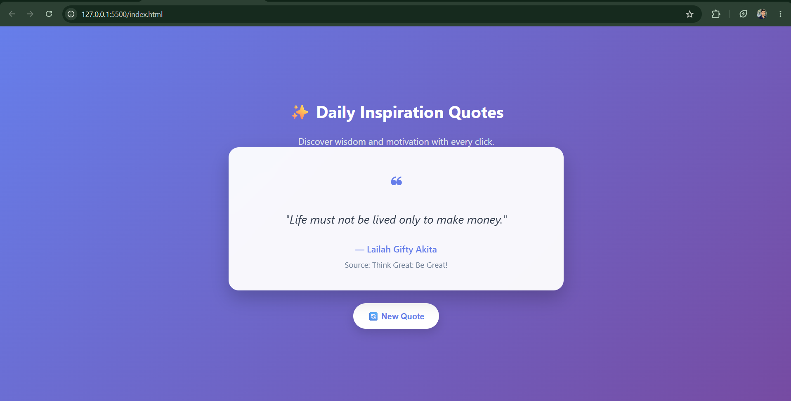

# ✨ Daily Inspiration Quote Generator

A modern and responsive **Quote Generator Web App** built using **HTML5, CSS3, and JavaScript**. The application fetches inspirational quotes from an API and displays a new quote with every click, featuring a clean UI, gradient background, and responsive design.

---

## 🌐 Live Demo

🚀 **View the live project here:**

### 🔗 https://prashantt05.github.io/synent-task6-API-Integration-Project_QuotesApp-prashant/

[]https://prashantt05.github.io/synent-task6-API-Integration-Project_QuotesApp-prashant/

---

# 📸 Project Preview



---

# ✨ Features

- 📖 Displays inspirational quotes
- 🔄 Generate a new quote with a single click
- 🎨 Modern gradient UI
- 💎 Glassmorphism-inspired quote card
- 📱 Fully Responsive Design
- ⚡ Fast and lightweight
- 🎯 Clean and minimal interface
- 👤 Displays quote author
- 📚 Displays the associated work or source (when available)
- 🌐 API-powered dynamic content

---

# 🛠️ Technologies Used

- HTML5
- CSS3
- JavaScript (ES6)
- Fetch API
- Google Fonts (Poppins)

---

# 📂 Project Structure

```text
Quote-Generator/
│
├── index.html
├── style.css
├── script.js
├── README.md
└── assets/
    └── preview.png
```

---

# 🎨 UI Components

### 📝 Quote Card

- Beautiful glassmorphism-inspired design
- Inspirational quote display
- Author information
- Source/work information

### 🔄 New Quote Button

- Generates a new random quote
- Smooth hover animation
- Responsive styling

### 🌈 Background

- Modern purple-blue gradient
- Minimal and clean design

---

# 📱 Responsive Design

Optimized for:

- 💻 Desktop
- 💼 Laptop
- 📱 Mobile
- 📟 Tablet

---

# 🚀 Getting Started

### Clone the repository

```bash
git clone https://github.com/prashantt05/synent-task4-Quote-Generator-prashant.git
```

### Navigate to the project

```bash
cd synent-task4-Quote-Generator-prashant
```

### Run the project

Open `index.html` in your browser or use the **Live Server** extension in Visual Studio Code.

---

# 🎯 Future Improvements

- ❤️ Favorite Quotes
- 📤 Share Quote to Social Media
- 📋 Copy Quote to Clipboard
- 🌙 Dark/Light Mode Toggle
- 🔍 Search Quotes by Author
- 🏷️ Filter Quotes by Category
- 🎲 Random Background Themes

---

# 📄 License

This project is licensed under the **MIT License**.

---

# 👨‍💻 Author

**Prashant Rajput**

- 💼 MERN Stack Developer
- 🤖 AI & ML Enthusiast
- 🎓 B.Tech CSE (AIML)

### 📫 Connect with Me

- **GitHub:** https://github.com/prashantt05
- **LinkedIn:** https://www.linkedin.com/in/prashant-rajput-838291329/
- **Email:** prashantt9405@gmail.com

---

⭐ **If you enjoyed this project, don't forget to give it a Star!**
